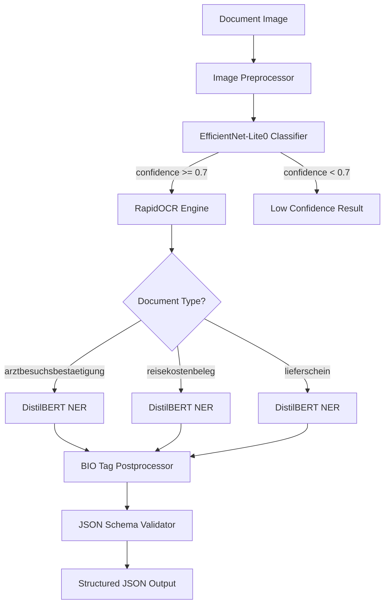

# Edge-AI Document Processing for BMD Go

On-device document classification and field extraction pipeline for the BMD Go mobile app. Processes three German business document types entirely on-device using ONNX Runtime.

## Architecture Overview



## Supported Document Types

| Document Type | Description | Key Fields |
|---|---|---|
| **Arztbesuchsbestaetigung** | Medical visit confirmation | Patient name, doctor, facility, date, time, duration |
| **Reisekostenbeleg** | Travel expense receipt | Vendor, date, amount, currency, VAT, category |
| **Lieferschein** | Delivery note | Delivery number, date, sender, recipient, items |

### Example Output (Arztbesuchsbestaetigung)

```json
{
  "document_type": "arztbesuchsbestaetigung",
  "patient_name": "Max Mustermann",
  "doctor_name": "Dr. Anna Schmidt",
  "facility_name": "Praxis am Marktplatz",
  "facility_address": "Hauptstr. 12, 1010 Wien",
  "visit_date": "2024-03-15",
  "visit_time": "10:30",
  "duration_minutes": 45,
  "confidence": 0.94
}
```

## Quick Start

```bash
# Install base + dev dependencies
uv sync --group dev

# Run the demo (generates sample images and processes them)
uv run python -m mobile_app.src.app demo

# Show model info
uv run python -m mobile_app.src.app info
```

## Full Setup

```bash
# Install all dependency groups
uv sync --group dev --group train --group ocr --group viz

# Generate training data (750 images + 4500 NER text samples)
uv run python scripts/generate_samples.py --count 250 --output-dir data/samples
uv run python scripts/generate_text_samples.py --count 1500 --output-dir data/samples
```

## Training Models from Scratch

### 1. Train Document Classifier

```bash
uv run python -m edge_model.classification.train \
    --data-dir data/samples \
    --output-dir edge_model/classification/models
```

### 2. Export Classifier to ONNX

```bash
uv run python -m edge_model.classification.export_onnx \
    --model-path edge_model/classification/models/best_model.pt \
    --output-path edge_model/classification/models/classifier.onnx
```

### 3. Train NER Extraction Models (one per document type)

```bash
for doctype in arztbesuchsbestaetigung reisekostenbeleg lieferschein; do
    uv run python -m edge_model.extraction.train \
        --document-type $doctype \
        --train-path data/samples/${doctype}_ner_train.jsonl \
        --val-path data/samples/${doctype}_ner_val.jsonl \
        --output-dir edge_model/extraction/models/${doctype%bestaetigung}
done
```

### 4. Export NER Models to ONNX

```bash
for model_dir in arztbesuch reisekosten lieferschein; do
    uv run python -m edge_model.extraction.export_onnx \
        --model-dir edge_model/extraction/models/$model_dir \
        --output-dir edge_model/extraction/models/$model_dir/onnx
done
```

## Running Tests

```bash
# Unit tests
uv run pytest tests/unit/ -v

# Integration tests (requires trained models)
uv run pytest tests/integration/ -v -m integration

# End-to-end tests (requires all models)
uv run pytest tests/e2e/ -v -m e2e

# Full suite
uv run pytest tests/ -v

# Linting
uv run ruff check .
```

## Project Structure

```
.
├── api/                        # Service layer
│   ├── models.py               # Pydantic data models + DocumentType enum
│   └── service.py              # DocumentService orchestrator
├── edge_model/
│   ├── classification/         # Document classifier
│   │   ├── config.py           # ClassificationConfig
│   │   ├── dataset.py          # Image dataset + transforms
│   │   ├── train.py            # Two-phase transfer learning
│   │   ├── export_onnx.py      # ONNX export + float16 quantization
│   │   └── validate.py         # ONNX model validation
│   ├── extraction/             # NER field extraction
│   │   ├── labels.py           # BIO tag definitions per doc type
│   │   ├── config.py           # ExtractionConfig
│   │   ├── dataset.py          # NER dataset with subword alignment
│   │   ├── train.py            # HuggingFace Trainer-based NER training
│   │   ├── postprocess.py      # BIO tags → structured fields
│   │   └── export_onnx.py      # ONNX export + INT8 quantization
│   └── inference/              # Runtime inference
│       ├── preprocessor.py     # Image preprocessing (ImageNet normalization)
│       ├── classifier_inference.py  # ONNX classifier wrapper
│       ├── extractor_inference.py   # ONNX NER wrapper
│       ├── validator.py        # JSON schema validation
│       ├── config.py           # PipelineConfig + YAML loader
│       └── pipeline.py         # Full pipeline orchestrator
├── ocr/                        # OCR module
│   ├── engine.py               # RapidOCR wrapper
│   ├── preprocessing.py        # Grayscale, thresholding, deskew
│   └── postprocessing.py       # Region sorting + text merging
├── mobile_app/                 # Demo CLI application
│   └── src/
│       ├── model_manager.py    # ONNX model file management
│       └── app.py              # CLI: process, info, batch, demo
├── scripts/
│   ├── generate_samples.py     # Synthetic document image generator
│   └── generate_text_samples.py # BIO-tagged NER text generator
├── data/
│   ├── schemas/                # JSON schemas for output validation
│   └── samples/                # Generated training data (gitignored)
├── tests/
│   ├── unit/                   # 333+ unit tests
│   ├── integration/            # OCR + model integration tests
│   └── e2e/                    # Full pipeline end-to-end tests
├── docs/
│   ├── architecture.md         # System architecture + Mermaid diagrams
│   └── model_pipeline.md       # Training + export procedures
├── config.yaml                 # Pipeline configuration (model paths)
└── pyproject.toml              # Dependencies managed via uv
```

## Technology Stack

| Component | Technology | Purpose |
|---|---|---|
| **Classifier** | EfficientNet-Lite0 (timm) | Document type classification |
| **OCR** | RapidOCR (PaddleOCR ONNX) | Text extraction from images |
| **NER Extractor** | DistilBERT German (transformers) | Named entity recognition for field extraction |
| **Runtime** | ONNX Runtime | Cross-platform model inference |
| **Quantization** | Float16 (classifier), INT8 (NER) | Model size reduction |
| **Data Models** | Pydantic v2 | Input/output validation |
| **Schema Validation** | jsonschema (Draft-07) | Output structure validation |
| **Package Manager** | uv | Fast Python dependency management |
| **Linting** | Ruff | Code quality enforcement |
| **Testing** | pytest | Unit, integration, and e2e tests |

## Model Sizes

| Model | Format | Size |
|---|---|---|
| EfficientNet-Lite0 Classifier | ONNX Float16 | 6.5 MB |
| DistilBERT NER (per doc type) | ONNX INT8 | 64 MB |
| **Total (all 4 models)** | | **~199 MB** |

## Team

| Role | Member |
|---|---|
| Project Lead | - |
| ML Engineering | - |
| Mobile Integration | - |
| Testing & QA | - |

## License

This project is developed as part of a student project (Studentprojekt) at AIS.
