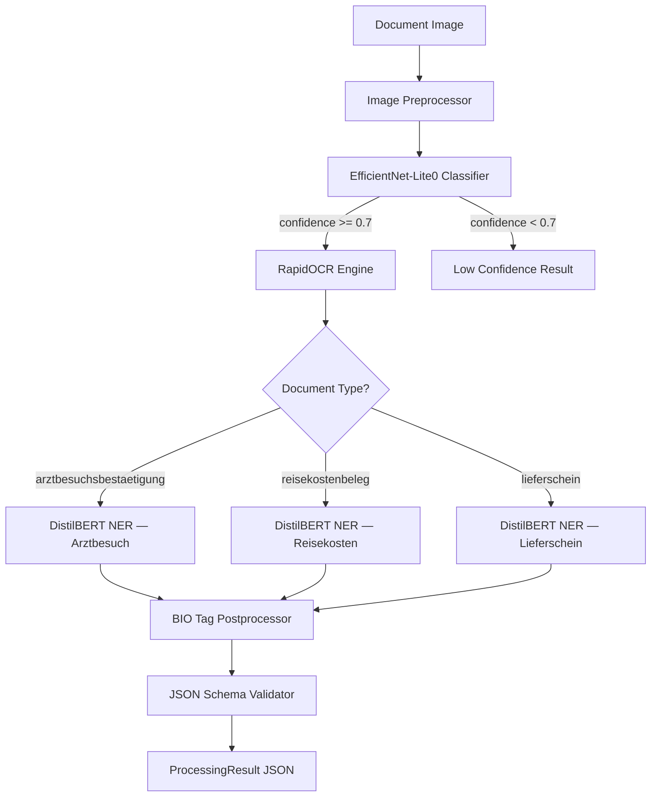
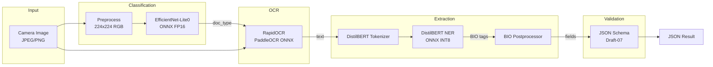
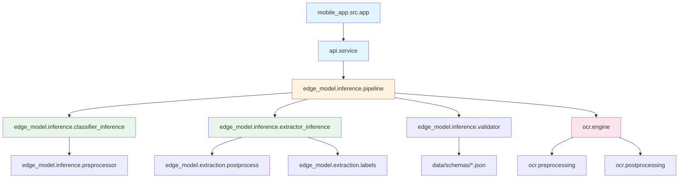

# Architecture Documentation

## System Overview

Edge-AI document processing pipeline for the BMD Go mobile app. Classifies German business documents and extracts structured fields, running entirely on-device via ONNX Runtime.

**Supported document types:**
- **Arztbesuchsbestätigung** — Medical visit confirmation
- **Reisekostenbeleg** — Business travel expense receipt
- **Lieferschein** — Delivery note

### Pipeline Flow

## Component Descriptions

### 1. Image Preprocessor (`edge_model/inference/preprocessor.py`)

Prepares raw camera images for the classifier:
- Resize to 224x224
- Normalize with ImageNet mean/std `([0.485, 0.456, 0.406], [0.229, 0.224, 0.225])`
- Convert HWC → CHW layout, add batch dimension

### 2. Document Classifier (`edge_model/classification/`)

**Model:** EfficientNet-Lite0 (pretrained on ImageNet, fine-tuned)
- **Input:** `(batch, 3, 224, 224)` float32 image tensor
- **Output:** `(batch, 3)` logits → softmax → class probabilities
- **Training:** Two-phase transfer learning (frozen backbone → full fine-tuning)
- **Export:** ONNX with float16 quantization

### 3. OCR Engine (`ocr/`)

**Library:** RapidOCR (PaddleOCR ONNX bundles)
- `preprocessing.py` — Grayscale conversion, adaptive thresholding, sharpening
- `engine.py` — Wraps RapidOCR, returns `OCRResult` with text regions, bounding boxes, confidence
- `postprocessing.py` — Sorts regions top-to-bottom/left-to-right, merges into readable text

### 4. Field Extractors (`edge_model/extraction/`)

**Model:** DistilBERT-base-german-cased (one fine-tuned model per document type)
- **Input:** Tokenized OCR text (max 256 tokens)
- **Output:** BIO tag sequence per token
- **Postprocessing:** BIO tags → merged field values → type-specific postprocessor → structured dict
- **Export:** ONNX with INT8 dynamic quantization

### 5. Schema Validator (`edge_model/inference/validator.py`)

Validates extracted fields against JSON Schema (Draft-07) definitions in `data/schemas/`. Ensures output correctness before returning results.

### 6. Pipeline Orchestrator (`edge_model/inference/pipeline.py`)

`DocumentPipeline` ties all components together:
1. Classify → get document type + confidence
2. Reject if confidence < threshold (default 0.7)
3. OCR → extract text from image
4. NER → extract fields from text using type-specific model
5. Validate → check fields against JSON schema
6. Return `ProcessingResult`

### 7. API Service (`api/service.py`)

`DocumentService` provides a high-level interface:
- `process_image(bytes)` — Decode image bytes, run pipeline
- `process_image_file(path)` — Load file, run pipeline
- `get_supported_types()` — List document types
- `get_schema(type)` — Return JSON schema

## Data Flow Diagram

## Model Specifications

| Model | Architecture | Input | Output | ONNX Size | Quantization |
|-------|-------------|-------|--------|-----------|--------------|
| Classifier | EfficientNet-Lite0 | `(1, 3, 224, 224)` float32 | `(1, 3)` logits | ~6.5 MB | Float16 |
| NER Arztbesuch | DistilBERT-base-german | `(1, ≤256)` int64 token IDs | `(1, ≤256, 14)` logits | ~64 MB | INT8 |
| NER Reisekosten | DistilBERT-base-german | `(1, ≤256)` int64 token IDs | `(1, ≤256, 15)` logits | ~64 MB | INT8 |
| NER Lieferschein | DistilBERT-base-german | `(1, ≤256)` int64 token IDs | `(1, ≤256, 17)` logits | ~64 MB | INT8 |
| PaddleOCR (bundled) | PaddleOCR det+rec+cls | RGB image (any size) | Text regions | ~10 MB | — |

**Total on-device footprint:** ~209 MB (classifier + 3 extractors + OCR)

## Module Dependency Graph

## ONNX Runtime Mobile Deployment

### Android (Kotlin)
- Add `onnxruntime-android` dependency
- Load models from `assets/` folder
- Use `OrtEnvironment` and `OrtSession` for inference
- Pre/post-processing in Kotlin using Android Bitmap API

### iOS (Swift)
- Add `onnxruntime-objc` via CocoaPods/SPM
- Load models from app bundle
- Use `ORTEnvironment` and `ORTSession`
- Pre/post-processing using Core Image / vImage

### Key considerations
- All models use `CPUExecutionProvider` (no GPU required)
- Classifier uses dynamic batch axis for flexibility
- NER models accept dynamic sequence lengths (up to 256)
- Total inference time target: < 2000ms on modern mobile CPU
