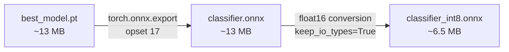
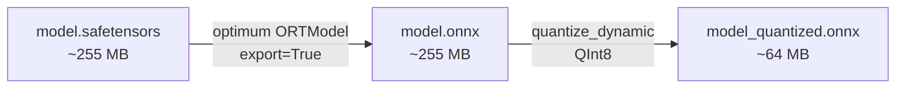

# Model Pipeline Documentation

## Training Instructions

### Prerequisites

```bash
# Install all dependency groups
uv sync --group dev --group train --group ocr
```

### 1. Generate Training Data

```bash
# Generate 250 synthetic document images per type (750 total)
uv run python scripts/generate_samples.py --count 250 --output-dir data/samples

# Generate 1500 NER text samples per type (4500 total, 80/20 train/val split)
uv run python scripts/generate_text_samples.py --count 1500 --output-dir data/samples
```

**Output:**
- `data/samples/arztbesuchsbestaetigung/` — 250 PNG images + 250 label JSON files
- `data/samples/reisekostenbeleg/` — 250 PNG images + 250 label JSON files
- `data/samples/lieferschein/` — 250 PNG images + 250 label JSON files
- `data/samples/{type}_ner_train.jsonl` — 1200 NER training samples per type
- `data/samples/{type}_ner_val.jsonl` — 300 NER validation samples per type

### 2. Train Document Classifier

```bash
uv run python -m edge_model.classification.train \
    --data-dir data/samples \
    --output-dir edge_model/classification/models
```

**Output:** `edge_model/classification/models/best_model.pt` + `metrics.json`

### 3. Export Classifier to ONNX

```bash
uv run python -m edge_model.classification.export_onnx \
    --model-path edge_model/classification/models/best_model.pt \
    --output-path edge_model/classification/models/classifier.onnx
```

**Output:** `classifier.onnx` (FP32) + `classifier_int8.onnx` (FP16 quantized)

### 4. Train NER Models (one per document type)

```bash
# Arztbesuchsbestätigung
uv run python -m edge_model.extraction.train \
    --document-type arztbesuchsbestaetigung \
    --train-path data/samples/arztbesuchsbestaetigung_ner_train.jsonl \
    --val-path data/samples/arztbesuchsbestaetigung_ner_val.jsonl \
    --output-dir edge_model/extraction/models/arztbesuch

# Reisekostenbeleg
uv run python -m edge_model.extraction.train \
    --document-type reisekostenbeleg \
    --train-path data/samples/reisekostenbeleg_ner_train.jsonl \
    --val-path data/samples/reisekostenbeleg_ner_val.jsonl \
    --output-dir edge_model/extraction/models/reisekosten

# Lieferschein
uv run python -m edge_model.extraction.train \
    --document-type lieferschein \
    --train-path data/samples/lieferschein_ner_train.jsonl \
    --val-path data/samples/lieferschein_ner_val.jsonl \
    --output-dir edge_model/extraction/models/lieferschein
```

### 5. Export NER Models to ONNX

```bash
uv run python -m edge_model.extraction.export_onnx \
    --model-dir edge_model/extraction/models/arztbesuch \
    --output-dir edge_model/extraction/models/arztbesuch/onnx

uv run python -m edge_model.extraction.export_onnx \
    --model-dir edge_model/extraction/models/reisekosten \
    --output-dir edge_model/extraction/models/reisekosten/onnx

uv run python -m edge_model.extraction.export_onnx \
    --model-dir edge_model/extraction/models/lieferschein \
    --output-dir edge_model/extraction/models/lieferschein/onnx
```

## Hyperparameter Documentation

### Classifier (EfficientNet-Lite0)

| Parameter | Value | Notes |
|-----------|-------|-------|
| `image_size` | 224 | Standard EfficientNet input |
| `num_classes` | 3 | One per document type |
| `batch_size` | 16 | |
| `lr_frozen` | 1e-4 | Phase 1: only classifier head trains |
| `lr_unfrozen` | 1e-5 | Phase 2: full fine-tuning |
| `epochs_frozen` | 5 | Frozen backbone epochs |
| `epochs_unfrozen` | 10 | Full fine-tuning epochs |
| `model_name` | `tf_efficientnet_lite0` | From timm library |

**Training augmentations:** RandomResizedCrop, RandomHorizontalFlip, ColorJitter, ImageNet normalization

### NER Extractors (DistilBERT-base-german-cased)

| Parameter | Value | Notes |
|-----------|-------|-------|
| `model_name` | `distilbert-base-german-cased` | German-specific pretrained model |
| `max_length` | 256 | Max token sequence length |
| `batch_size` | 16 | |
| `lr` | 5e-5 | Standard BERT fine-tuning LR |
| `epochs` | 20 | Default (3 epochs sufficient for synthetic data) |
| `weight_decay` | 0.01 | AdamW regularization |

**Training strategy:** HuggingFace Trainer with evaluation per epoch, best model by F1, early stopping via `load_best_model_at_end=True`.

## ONNX Export and Quantization

### Classifier Export



- Uses TorchScript-based export (`dynamo=False`) for compatibility
- Float16 quantization via `onnxruntime.transformers.float16`
- **Important:** INT8 dynamic quantization does NOT work for Conv-heavy models — causes ~60% accuracy drop

### NER Export



- Uses `optimum.onnxruntime.ORTModelForTokenClassification` for export
- INT8 dynamic quantization works well for transformer models (~75% size reduction)
- Tokenizer files (vocab, config) are copied alongside the ONNX model

## How to Add a New Document Type

### Step-by-step guide

1. **Create JSON schema** in `data/schemas/{new_type}.json`
   - Follow existing schemas as template (Draft-07, required fields, `additionalProperties: false`)

2. **Add Pydantic model** in `api/models.py`
   - Create `NewTypeResult(BaseModel)` matching the schema
   - Add value to `DocumentType` enum

3. **Define NER labels** in `edge_model/extraction/labels.py`
   - Add `NEW_TYPE_LABELS` list with BIO tags (must start with "O")
   - Add entry to `LABEL_SETS` dict

4. **Create data generator** in `scripts/generate_samples.py`
   - Add `generate_new_type(output_dir, count)` function
   - Generate realistic synthetic images with ground-truth labels

5. **Create NER text generator** in `scripts/generate_text_samples.py`
   - Add `generate_new_type_ner(count)` function
   - Generate BIO-tagged text samples simulating OCR output

6. **Add postprocessor** in `edge_model/extraction/postprocess.py`
   - Create `postprocess_new_type(raw_fields)` function
   - Add to `POSTPROCESSORS` dict

7. **Update classification config** in `edge_model/classification/config.py`
   - Increment `num_classes`
   - Add new type to `class_names` (keep alphabetically sorted!)

8. **Generate data, train, and export**
   ```bash
   # Generate training data
   uv run python scripts/generate_samples.py --count 250
   uv run python scripts/generate_text_samples.py --count 1500

   # Retrain classifier (all types)
   uv run python -m edge_model.classification.train --data-dir data/samples --output-dir edge_model/classification/models
   uv run python -m edge_model.classification.export_onnx --model-path edge_model/classification/models/best_model.pt --output-path edge_model/classification/models/classifier.onnx

   # Train new NER model
   uv run python -m edge_model.extraction.train --document-type new_type --train-path data/samples/new_type_ner_train.jsonl --val-path data/samples/new_type_ner_val.jsonl --output-dir edge_model/extraction/models/new_type
   uv run python -m edge_model.extraction.export_onnx --model-dir edge_model/extraction/models/new_type --output-dir edge_model/extraction/models/new_type/onnx
   ```

9. **Update config.yaml** with new model paths

10. **Add tests** for the new type in `tests/unit/`, `tests/integration/`, and `tests/e2e/`

## Performance Benchmarks

### Classification Accuracy

| Metric | Value |
|--------|-------|
| Overall validation accuracy | 93.33% (PyTorch) |
| ONNX FP32 accuracy | 98.93% |
| ONNX FP16 accuracy | 98.40% |

Per-class (PyTorch training):
| Class | Precision | Recall |
|-------|-----------|--------|
| Arztbesuchsbestätigung | 0.84 | 0.96 |
| Reisekostenbeleg | 1.00 | 0.78 |
| Lieferschein | 0.85 | 0.92 |

### NER Extraction F1 Scores

| Document Type | Validation F1 |
|---------------|--------------|
| Arztbesuchsbestätigung | 0.9995 |
| Reisekostenbeleg | 0.9987 |
| Lieferschein | 0.9991 |

*Note: High F1 scores reflect synthetic training data with consistent patterns. Real-world performance will be lower.*

### Model Sizes

| Model | FP32 | Quantized | Reduction |
|-------|------|-----------|-----------|
| Classifier | 12.9 MB | 6.5 MB (FP16) | 50% |
| NER (each) | 255 MB | 64 MB (INT8) | 75% |
| **Total (4 models)** | **778 MB** | **199 MB** | **74%** |

### Inference Speed (CPU)

Target: < 2000ms total per document on modern mobile CPU.
- Classification: ~50ms
- OCR: ~500-1000ms (depends on image complexity)
- NER extraction: ~100-200ms
- Postprocessing + validation: ~5ms
